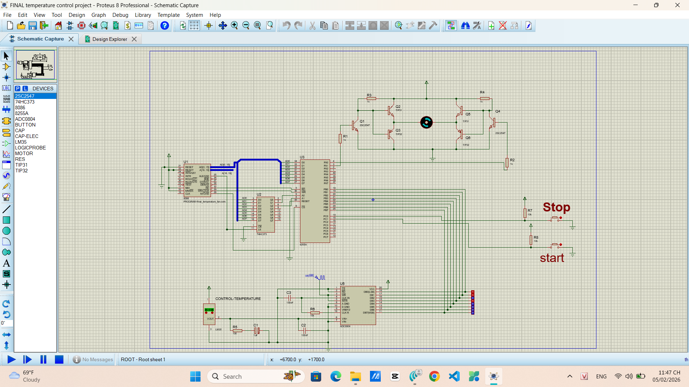
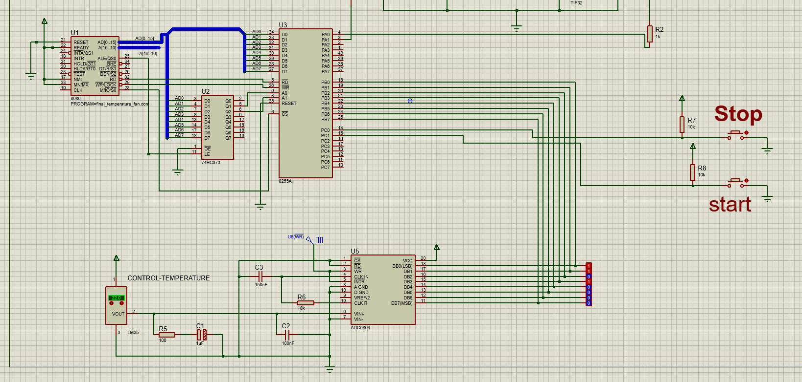
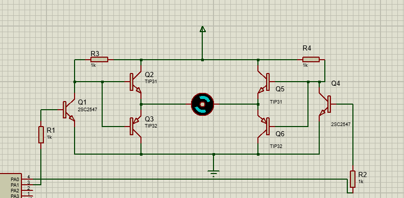

# 8086 Microprocessor: Smart Temperature Control System

This project implements an automated temperature regulation system using the **8086 Microprocessor**. The system is designed to maintain room temperature within an optimal range (23°C to 32°C) by controlling a cooling fan through hardware-software integration.

---

## 🛠 Tech Stack

* **Language:** Assembly 8086 (Low-level programming).
* **Hardware Simulation:** Proteus 8.17.
* **Microprocessor Architecture:** Intel 8086, 8255 PPI, ADC0804, LM35 Sensor.

---

## 📂 Project Structure

Following a professional organization, the repository is structured as follows:

| Directory | Description |
| :--- | :--- |
| `src/` | Contains the primary assembly source code (`final_temperature_fan.asm`). |
| `simulation/` | Contains the Proteus design file and compiled firmware. |
| `docs/` | Detailed project report (PDF) and system architecture diagrams. |

---

## ⚙️ System Logic

* **Normal Range (23°C - 32°C):** The system remains idle to save energy.
* **Active Range (Outside [23, 32]):** The 8086 triggers the 8255 PPI to activate the fan motor immediately.
* **Hardware Interfacing:** Uses **ADC0804** for Analog-to-Digital conversion of LM35 sensor data and **8255 PPI** for peripheral control.

---

## 📸 Screenshots

### System Overview

*Figure 1: Complete circuit simulation in Proteus*

### Integration Details
| Components Detail | Fan Actuator |
| :---: | :---: |
|  |  |
| *Figure 2: LM35, ADC0804, and 8255 PPI* | *Figure 3: Output control for the fan* |

---

## 🚀 How to Run:
*Note: I have prepared  **explanation video** to understanding easly of my project
https://disk.yandex.com.tr/i/x6q5UAOW2R7MMQ*  

### 1. Clone the project
```bash
git clone [https://github.com/ThinhBanTo/8086-Temperature-Control-System.git](https://github.com/ThinhBanTo/8086-Temperature-Control-System.git)
```
### 2. Compile Source
1. Open the file `src/final_temperature_fan.asm` using **emu8086**.
2. Click the **Compile** button to assemble the source code.
3. Save the generated firmware file in `.com` or `.bin` format.

### 3. Run Simulation
1. Open `simulation/FINAL temperature control project.pdsprj` in **Proteus 8.17**.
2. Right-click on the **8086 CPU** component in the schematic and select **"Edit Component"**.
3. In the **"Program File"** field, click the folder icon and browse to the `.com` or `.bin` file you compiled in the previous step.
4. Click **OK** to confirm.
5. Press the **Start (Play)** button at the bottom-left corner to run the simulation.

---

## 📄 Documentation

For a deep dive into the register-level logic and hardware pin connections, please refer to our full report:

👉 [**Read Project Report (PDF)**](docs/BTL_KTMT.pdf)

---

**Author:** Nguyen Khac Thinh - IT Student (Talent Program) at PTIT.
